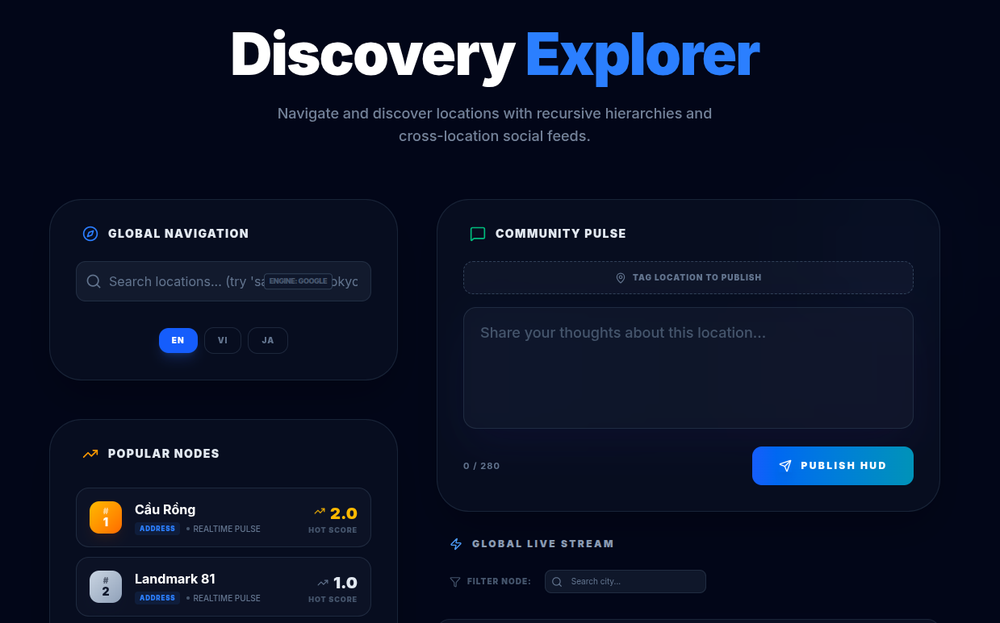

# 📍 Social Discovery Hub (Location Demo)

A full-stack reference implementation demonstrating how to build a scalable, multi-language location discovery and social feed system using **Clean Architecture**. This platform serves as a "Social Discovery Hub", allowing users to tag locations, browse live global feeds, and navigate hierarchical location graphs dynamically.



## 🌟 Key Features

*   **Social Discovery & Live Feeds:** Create and browse posts enriched with granular location data. Instantly toggle between a global feed and a city/district-scoped node filter.
*   **Intelligent JIT Hydration ("Save on Intent"):** Instead of pre-fetching millions of locations, the system connects directly to Google Places. When a user creates a post and selects a new location, the server "hydrates" it (saving the exact node and all its hierarchical parents) on the fly via robust, high-concurrency UPSERTs.
*   **Search Types & Fallbacks:** Seamlessly fallback from Local Aliases to Translations to Google API. Search deduplication handles case inconsistencies safely.
*   **Dynamic Language Scoping:** Built-in multi-language toggles (`EN`, `VI`, `JA`). Search for locations matching your intent (e.g., searching a Vietnamese address translates directly into the preserved data structure) overriding the global UI settings instantly.
*   **Trending Algorithms:** "Popular Nodes" are computed dynamically and re-rendered in real-time immediately after post publication without requiring a page refresh.

## 🛠️ Technology Stack

| Layer | Technologies |
| :--- | :--- |
| **Frontend** | [Next.js 14+](https://nextjs.org/) (App Router), React, Tailwind CSS |
| **Backend** | [Go 1.25+](https://golang.org/), [Gin Web Framework](https://gin-gonic.com/) |
| **Database** | [PostgreSQL 16](https://www.postgresql.org/) (GORM enabled for advanced querying) |
| **External API**| Google Places API / Autocomplete |
| **Infra** | Docker & Docker Compose |

## 🚀 Quick Start (Recommended)

The easiest way to run the full stack is via Docker. The application is pre-configured to automatically run database migrations and seed data on startup.

**Prerequisites:** 
*   Docker & Docker Compose v2 (`docker compose`)
*   Make
*   Google Maps API Key (Add to `.env` file as `GOOGLE_MAPS_API_KEY=your_key`)

```bash
# 1. Provide Environment configuration
cp example.env .env

# 2. Build and start all services (Database, API, Frontend)
make up

# 3. View logs to ensure everything is running smoothly
make logs
```

Once running, you can access the applications:
*   **Frontend UI:** [http://localhost:3001](http://localhost:3001)
*   **Backend API:** [http://localhost:8088/health](http://localhost:8088/health)
*   **PostgreSQL:** `localhost:5433` (User: `postgres` / Pass: `postgres`)

To stop the environment:
```bash
make down
```

## ⌨️ Useful Make Commands

There is a `Makefile` included to help you manage the project efficiently:

| Command | Action |
| :--- | :--- |
| `make build` | Builds all Docker images (API & Frontend) |
| `make up` | Starts all services in the background |
| `make down` | Stops and removes Docker containers and networks |
| `make logs` | Tails the logs for all running Docker services |
| `make clean` | Wipes **ALL** Docker data, including database volumes |
| `make backend-run` | Runs the Go backend locally (without Docker) |
| `make frontend-dev`| Starts Next.js development server locally |

*(Run `make help` to see all available commands).*

## 📖 Documentation

If you want to understand the design decisions, schema, and API structure in-depth, refer to the documentation files in the `docs/` directory:

*   [`docs/gui.md`](./docs/gui.md): High-level system architecture, DB Schema, and project layout.
*   [`docs/how_to_get_gg_map_api_key.md`](./docs/how_to_get_gg_map_api_key.md): Guide on getting the required external API credentials.
*   [`docs/location.md`](./docs/location.md): Foundational database planning/theory notes.
