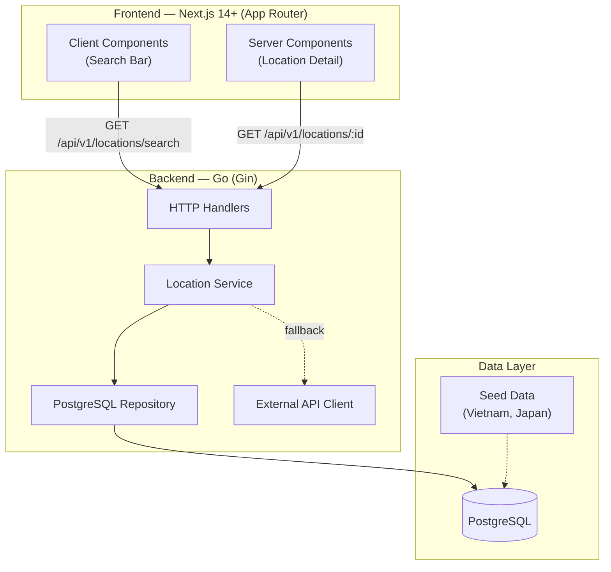

# 📍 Location Demo System — Technical Specification

> A reference implementation for learning location-based features with Clean Architecture in Go and Next.js.

---

## 1. System Overview

This demo covers:

- ✅ Smart search with alias matching (`"sai gon"` → Ho Chi Minh City)
- ✅ Multi-language display (EN / VI / JA)
- ✅ Location hierarchy (Country → City → District → Landmark)
- ✅ External API fallback (OpenStreetMap Nominatim Default)
- ❌ No posts, trending, or stats (out of scope for this demo)

---

## 2. Architecture



### Tech Stack

| Layer | Technology | Why |
| :--- | :--- | :--- |
| Frontend | Next.js 14+ (App Router), Tailwind CSS | Server/Client component split, SSR for SEO |
| Backend | Go 1.21+, Gin | High performance, explicit dependency injection |
| Database | PostgreSQL 16 | Relational + hierarchy support |
| Infra | Docker Compose | One-command local environment |

---

## 3. Database Schema

Three core tables. No posts, stats, or trending (out of scope).

### 3.1 `locations`

```sql
CREATE TABLE locations (
    id SERIAL PRIMARY KEY,
    external_id VARCHAR(255) UNIQUE,
    type VARCHAR(50) NOT NULL DEFAULT 'city',
    lat DOUBLE PRECISION NOT NULL,
    lng DOUBLE PRECISION NOT NULL,
    parent_id INTEGER REFERENCES locations(id),
    path TEXT,
    created_at TIMESTAMP WITH TIME ZONE DEFAULT NOW()
);
```

### 3.2 `location_translations`

```sql
CREATE TABLE location_translations (
    location_id INTEGER REFERENCES locations(id) ON DELETE CASCADE,
    lang_code VARCHAR(5) NOT NULL,
    name TEXT NOT NULL,
    PRIMARY KEY (location_id, lang_code)
);
```

### 3.3 `location_alias`

```sql
CREATE TABLE location_alias (
    id SERIAL PRIMARY KEY,
    location_id INTEGER REFERENCES locations(id) ON DELETE CASCADE,
    alias TEXT NOT NULL
);
```

### Hierarchy Example

| id | name | type | parent_id | path |
| -- | ---- | ---- | --------- | ---- |
| 1 | Vietnam | country | NULL | `1` |
| 2 | Ho Chi Minh City | city | 1 | `1/2` |
| 4 | District 1 | district | 2 | `1/2/4` |
| 5 | Bitexco Tower | landmark | 4 | `1/2/4/5` |

---

## 4. Backend Architecture (Go)

### 4.1 Project Structure

```
backend/
├── cmd/api/main.go               # Entry point, DI wiring
├── internal/
│   ├── config/config.go           # Env-based configuration
│   ├── domain/location.go         # Models + Interfaces (THE CENTER)
│   └── location/
│       ├── handler.go             # HTTP layer (thin, no logic)
│       ├── service.go             # Business logic (waterfall search)
│       └── repository.go          # PostgreSQL queries
├── migrations/
│   ├── 001_create_tables.up.sql
│   ├── 001_create_tables.down.sql
│   └── seed.sql
├── Dockerfile
├── .env.example
└── go.mod
```

### 4.2 Domain Layer (`/domain`)

The center of the application. Contains:

- **Models**: `Location`, `LocationTranslation`, `LocationAlias`, `LocationDetail`, `SearchResult`
- **Interfaces**: `LocationRepository`, `ExternalLocationProvider`

> Key principle: **"Accept interfaces, return structs."** The domain package imports nothing from the app. Everything else imports domain.

```go
// internal/domain/location.go

type LocationRepository interface {
    GetByID(ctx context.Context, id int64, lang string) (*LocationDetail, error)
    SearchByAlias(ctx context.Context, query string) ([]SearchResult, error)
    SearchByTranslation(ctx context.Context, query string, lang string) ([]SearchResult, error)
    InsertLocation(ctx context.Context, loc *Location, translations []LocationTranslation, aliases []LocationAlias) (int64, error)
    GetChildren(ctx context.Context, parentID int64, lang string) ([]SearchResult, error)
}

type ExternalLocationProvider interface {
    Search(ctx context.Context, query string, lang string) ([]Location, []LocationTranslation, error)
}
```

### 4.3 Search Strategy (Waterfall)

The service implements a fallback chain to maximize cache hits and minimize external API costs:

```
1. SearchByAlias    →  "sai gon" matches alias → return Ho Chi Minh City
2. SearchByTranslation → "Hồ Chí Minh" matches vi translation → return
3. External API     →  Call OpenStreetMap → save to DB → return
```

### 4.4 REST API Endpoints

| Method | Endpoint | Description |
| :----- | :------- | :---------- |
| `GET` | `/api/v1/locations/search?q=sai+gon&lang=vi` | Waterfall search |
| `GET` | `/api/v1/locations/:id?lang=en` | Location detail with parent |
| `GET` | `/api/v1/locations/:id/children?lang=en` | Sub-locations list |
| `GET` | `/health` | Health check |

### 4.5 Dependency Injection (in `main.go`)

```go
repo := location.NewPostgresRepository(db)
svc  := location.NewService(repo, nil)   // nil = no external API yet
handler := location.NewHandler(svc)
handler.RegisterRoutes(router)
```

No framework needed — just constructor functions.

---

## 5. Frontend Architecture (Next.js)

### 5.1 Project Structure

```
frontend/
├── app/
│   ├── layout.tsx                 # Root layout (nav, fonts, global CSS)
│   ├── page.tsx                   # Home/Search page
│   ├── globals.css                # Design system (gradients, glass, glow)
│   └── location/
│       └── [id]/page.tsx          # Detail page (Server Component)
├── components/
│   ├── SearchBar.tsx              # Client Component (debounced input)
│   └── LocationCard.tsx           # Reusable card with type badges
├── lib/
│   └── api.ts                     # Centralized API client
├── Dockerfile
└── package.json
```

### 5.2 Component Strategy

| Component | Type | Why |
| :-------- | :--- | :-- |
| `page.tsx` (detail) | Server Component | SSR for SEO, fetches data on server |
| `SearchBar.tsx` | Client Component | Needs `useState`, event handlers, debounce |
| `LocationCard.tsx` | Server Component | Pure presentational, no interactivity |

### 5.3 Key Patterns

- **Debouncing**: 300ms delay on search input to prevent API spam
- **Language Switching**: URL-based (`?lang=vi`) for shareable links
- **Glassmorphism UI**: `backdrop-blur` + semi-transparent backgrounds

---

## 6. Infrastructure

### Makefile (Recommended)

Use the root `Makefile` to quickly manage common tasks.

```bash
make help       # View all commands
make up         # Start all services with Docker Compose
make down       # Stop all services
make logs       # Follow logs from all services
make backend-tidy   # Run go mod tidy in the backend
make frontend-dev   # Start Next.js on :3001 locally
```

### Docker Compose

```bash
docker compose up -d    # Starts PostgreSQL + Backend + Frontend
```

Services:
- `db` — PostgreSQL 16 on `:5433` (auto-runs migrations & seed on first start)
- `backend` — Go API on `:8088`
- `frontend` — Next.js on `:3001`

### Local Development (without Docker)

```bash
# Terminal 1: Database
psql -U postgres -c "CREATE DATABASE location_demo;"
psql -U postgres -d location_demo -f backend/migrations/001_create_tables.up.sql
psql -U postgres -d location_demo -f backend/migrations/seed.sql

# Terminal 2: Backend
cd backend && cp .env.example .env && go run ./cmd/api

# Terminal 3: Frontend
cd frontend && npm run dev
```

---

## 7. Seed Data

Pre-loaded locations for immediate testing:

| Location | Type | Aliases |
| :------- | :--- | :------ |
| Vietnam | country | — |
| Ho Chi Minh City | city | `sai gon`, `hcm`, `tp hcm`, `saigon` |
| Hanoi | city | `ha noi` |
| Da Nang | city | `da nang`, `danang` |
| District 1 | district | — |
| Bitexco Tower | landmark | — |
| Hoan Kiem Lake | landmark | — |
| Japan | country | — |
| Tokyo | city | `toukyou` |
| Shibuya | district | — |

Languages: English (en), Vietnamese (vi), Japanese (ja)

---

## 8. Build Order

| # | Task | Status |
| - | ---- | ------ |
| 1 | Database schema + migrations | ✅ Done |
| 2 | Seed data (Vietnam + Japan) | ✅ Done |
| 3 | Go domain models + interfaces | ✅ Done |
| 4 | PostgreSQL repository | ✅ Done |
| 5 | Location service (waterfall search) | ✅ Done |
| 6 | HTTP handlers + router | ✅ Done |
| 7 | Next.js search page | ✅ Done |
| 8 | Next.js detail page | ✅ Done |
| 9 | Docker Compose | ✅ Done |
| 10 | External API integration | 🔲 Optional |
| 11 | Map view + nearby search | 🔲 Optional |